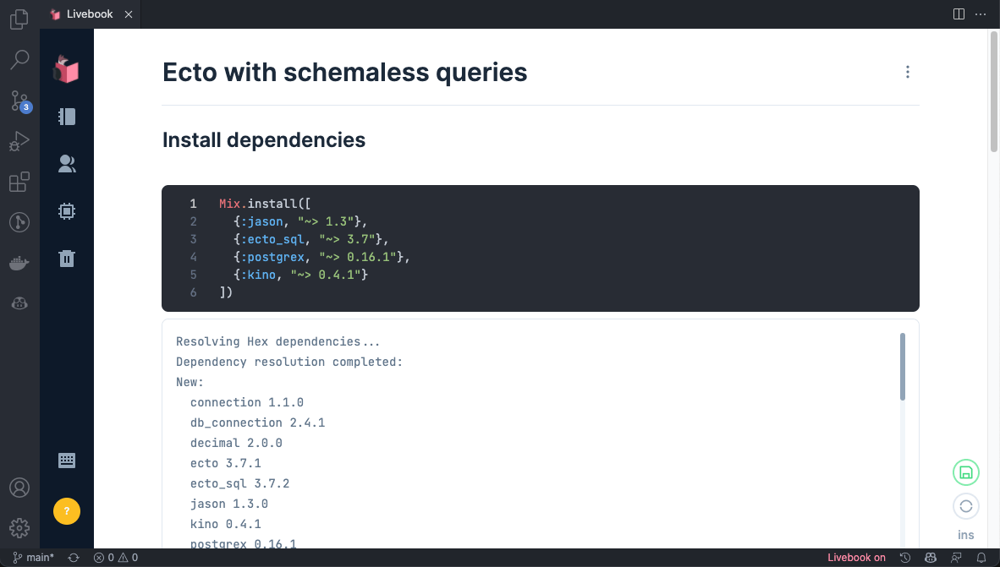

# VS Code Livebook (WIP)

> Currently only working on unix systems with Elixir and Erlang installed.

An extension to run a Livebook instance inside your VS Code

## Planned features

- ✅ Run and access Livebook directly on VS Code
- ❎ Run without the need of local installations of Erlang and Elixir
- ❎ Open `.livemd` files with Livebook directly on VS Code

## Known Issues

* A custom Livebook build is needed because of two reasons:  
    1. The default behavior of Livebook is to open the default system browser when the server is started.  
    This cannot happen here because the expected behavior is to use Livebook inside VS Code.
    2. It is necessary to use and `iframe` to render a webpage (Livebook) inside VS Code, and by default, Livebook is configured to not allow it.
* Drag and drop not working to import `.livemd` files.
* Copy and paste not working to import `.livemd` files.
